# Project - Blog with Hugo, Netlify CMS & Zapier

> This project was inspired by several blog posts written by [Flavio Copes](https://flaviocopes.com). He writes
> incredible content and I highly recommend you checkout his blog frequently.

In this project we are going to build a blog using the [Hugo](https://gohugo.io) Static Site Generator, which we will
then deploy to Netlify as our hosting provider. Once our blog is complete and live on Netlify, we will then integrate
[Zapier](https://zapier.com/) to trigger automatic deploys/builds of our site. This will allow us to write blog posts
ahead of time by setting a publish date some time in the future and then Zapier will notify Netlify to build our site so
that the entire process is automated.

## Installing Hugo

Hugo is written in the Go Programming Language which makes it very easy to install, since it is just a single binary. To
install Hugo, head over to their [Installation Docs](https://gohugo.io/getting-started/installing) and follow along for
whatever operating system you are using. I personally am using Mac and have installed Hugo with
[Homebrew](https://brew.sh/). I highly recommend using Homebrew if you are on a Mac.

## Creating the blog

Now that you have Hugo installed, run the following command to create a new hugo site:

```bash
hugo new site blog

# blog will be the name of the folder and project, feel free to name it whatever you like
```

> If you are like me, you probably already have a directory where all of your web/code projects live on your computer. I
> have a folder called `Projects` on my computer which contains all of my projects. I recommend you have something
> similar on your machine.

We are going to be using a pre-configured theme for Hugo called [Ink](https://themes.gohugo.io/hugo-ink/). You can
download the theme from Github [here](https://github.com/knadh/hugo-ink). Click on the Green button called "Code"
and then "Download Zip."

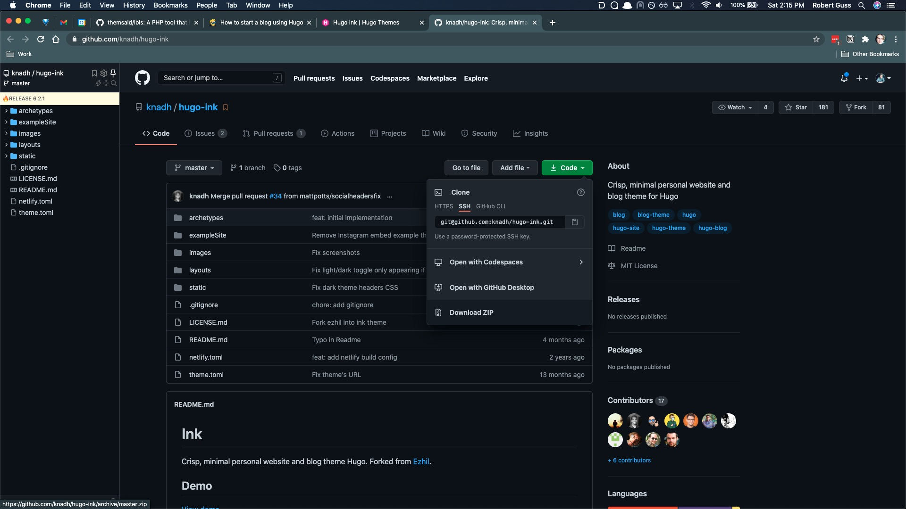

When you download the zip file and unzip it, it will most likely be called `hugo-ink-master` simply rename the folder
to `ink` and then move it inside of the `themes` folder.

Your hugo project should now look like this:

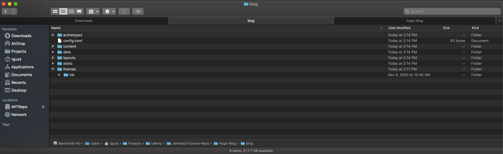

Inside of the `ink` theme folder is another folder called `exampleSite`. This contains some example content
which we can use to temporarily populate our site with some pages and posts.

1. Copy the directory `themes/ink/exampleSite/archetypes/` and replace `/archetypes/` located at the root of the
   project with it.
2. Copy the directory `themes/ink/exampleSite/content/` and replace `/content/` located at the root of the
   project with it.
3. Copy the directory `themes/ink/exampleSite/data/` and replace `/data/` located at the root of the
   project with it.
4. Copy the file `themes/ink/exampleSite/config.toml` and replace `config.toml` located at the root of the
   project with it.

Now run the following command in your terminal to start the hugo server:

```bash
hugo serve
```

If everything is configured and setup properly, you should see the following at `http://localhost:1313/`

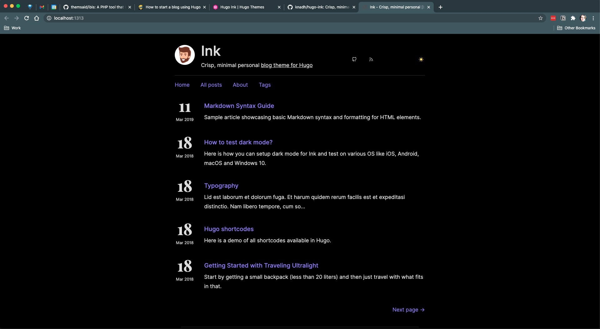

> Your site might have a white background which is fine, this theme has both light and dark themes which are toggled
> based upon your system preferences.

## Instant Reload & Creating new posts

Hugo's built in dev server will automatically reload the page whenever it detects a page. You can see this in action by
modifying one of the posts located at `content/posts/`. If you make any changes to one of these files, the browser will
reload and update with your changes virtually instantly! Pretty sweet right 😎

To create a new post, you will either have to stop the hugo server, or open up another terminal window in the project
directory and run the following command.

```bash
hugo new posts/my-first-post.md
```

Feel free to name the file whatever you like. Once this file is created, you will need to modify what is known as the
[Front Matter](https://gohugo.io/content-management/front-matter) at the top of the file.

If you open up one of the sample posts you will see something like the following at the top:

```yaml
---
title: 'Markdown Syntax Guide'
date: '2019-03-11'
description: 'Sample article showcasing basic Markdown syntax and formatting for HTML elements.'
tags: [markdown, css, html, themes]
categories: [themes, syntax]
---

```

This is what is known as `Front Matter`. This data is what Hugo uses to generate various data on our site. The data in
the example above is fairly self-explanatory, the title is the title of our post, the date is the date we wrote our
post, the description is the description of our post, the tags and categories act as ways of tagging or categorizing
various posts together on our site.

This is all entirely customizable by you. With the correct theme and config modifications, you can have Hugo parse and
use all kinds of custom data located in the `Front Matter`.

Take the example I used above and paste it into your new post. This will give us a "skeleton" to work with.

Here is what my post looks like:

```markdown
---
title: 'My First Post'
date: '2020-12-12'
description: 'This is the description of my first post'
tags: [markdown]
categories: [syntax]
---

Lorem ipsum dolor sit amet, consectetur adipiscing elit. In vel nibh ligula. Duis in pulvinar mi. Mauris imperdiet turpis a imperdiet blandit. Maecenas pulvinar eleifend nisi vel porta. Mauris suscipit vel risus sed ultrices. Suspendisse elementum tortor vel aliquam feugiat. Duis porttitor tincidunt tellus, vitae faucibus tortor rhoncus vel. Sed egestas est efficitur congue blandit. Integer finibus maximus mauris, vel venenatis mauris tristique quis.
```

The homepage should have been updated with your latest post and should look something like this:

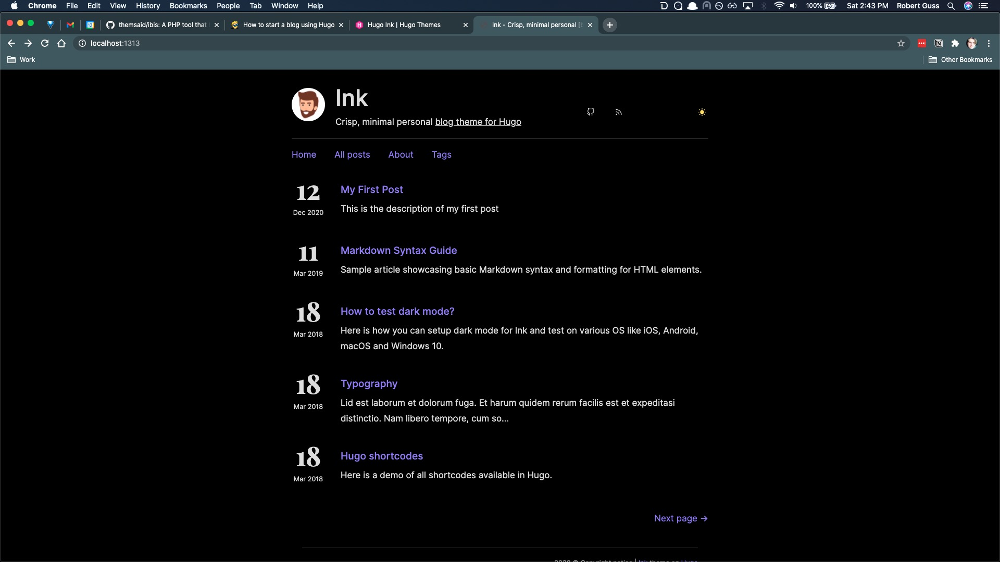

## Pushing our project to GitHub

Before we can deploy our site, we need to first push our site up to GitHub.

> If you do not have a [GitHub](https://github.com/) account, please sign up for a free account as you are going to need
> it throughout this course.

> Your GitHub may not be dark like mine, I am using their dark theme, which is _not_ enabled by default.

Create a new repository by clicking the `+` in the upper right hand corner then "New repository"

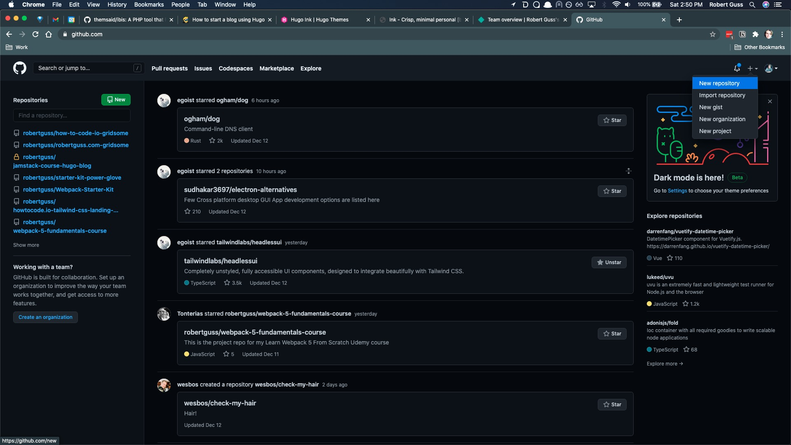

Fill out the repository name and description field and choose whether or not to make the repo private or public. It
doesn't matter which one you choose. Netlify will work with both public and private repos.

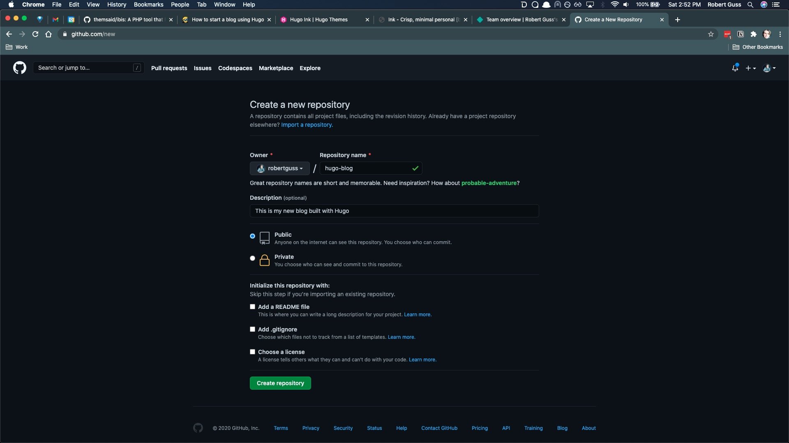

Then click the green button "Create repository"

You should then be presented with a screen that looks similar to this:

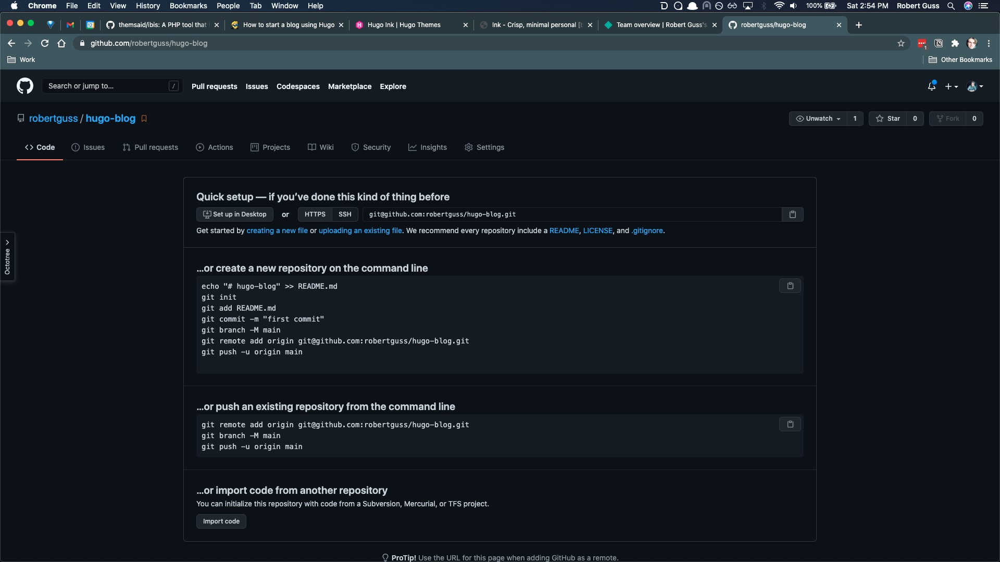

> This next section requires you to have [Git](https://git-scm.com/) installed. If you do not have Git installed, you
> can download it [here](https://git-scm.com/downloads)

Head back over to your terminal inside of your hugo directory and run the following, in this order.

```bash
git init # initializes a new git repository
git add . # adds all of the files to git
git commit -m "init commit" # creates a new commit with the message "init commit"
```

Then you are going to need to copy the url for your git repo in GitHub. It is located in this section of your empty
GitHub repo.

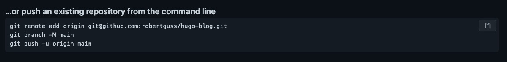

Paste it into your terminal:

```bash
git remote add origin git@github.com:robertguss/hugo-blog.git
```

Then do:

```bash
git push -u origin master
```

Refresh GitHub and you should see the following:

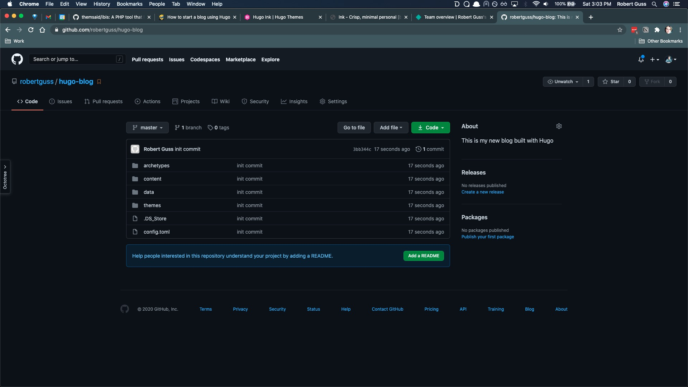

Now you are all set and ready to deploy with Netlify

## Deploying to Netlify

Now that our site is all setup and running, let's learn how to deploy our static site to
[Netlify](https://www.netlify.com/). Netlify is free and is one of the most popular hosting providers for the Jamstack.
Head on over to their site and sign up for an account, Use your GitHub account to sign up.

Once you sign up, you should land on a dashboard which looks like the following:

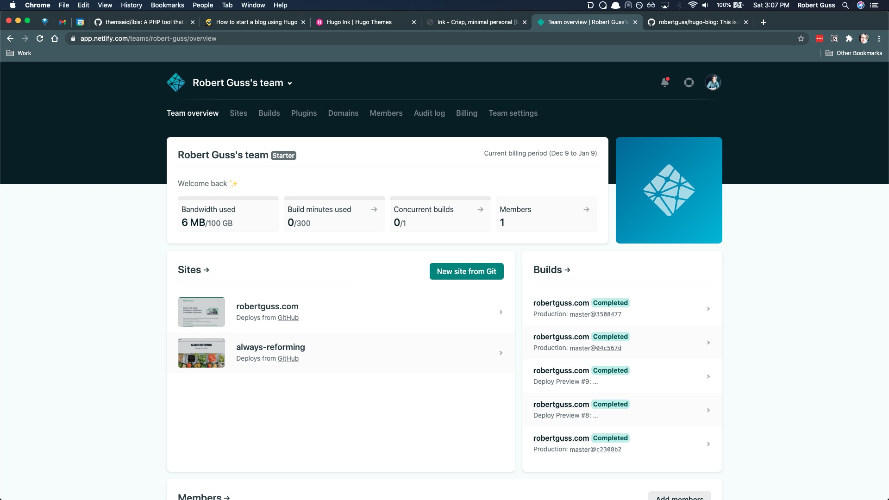

Click on the "New site from Git" button.

On the next screen, click on the "GitHub" button

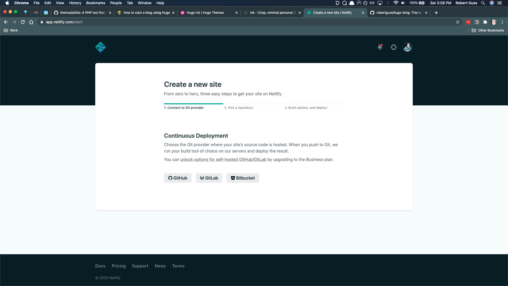

You will want to connect your GitHub account to Netlify and give them access to all of your repos.

You will then need to seach for the repo we just created and select it. I named mine `hugo-blog` so I can easily seach
for it in the search bar.

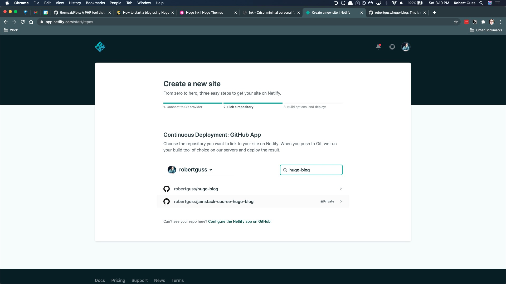

It should automatically detect that this is a Hugo project and fill in the form fields for you. Just in case it doesn't,
fill out the fields like you see in the screenshot. The build command is `hugo` and the publish directory is `public`.

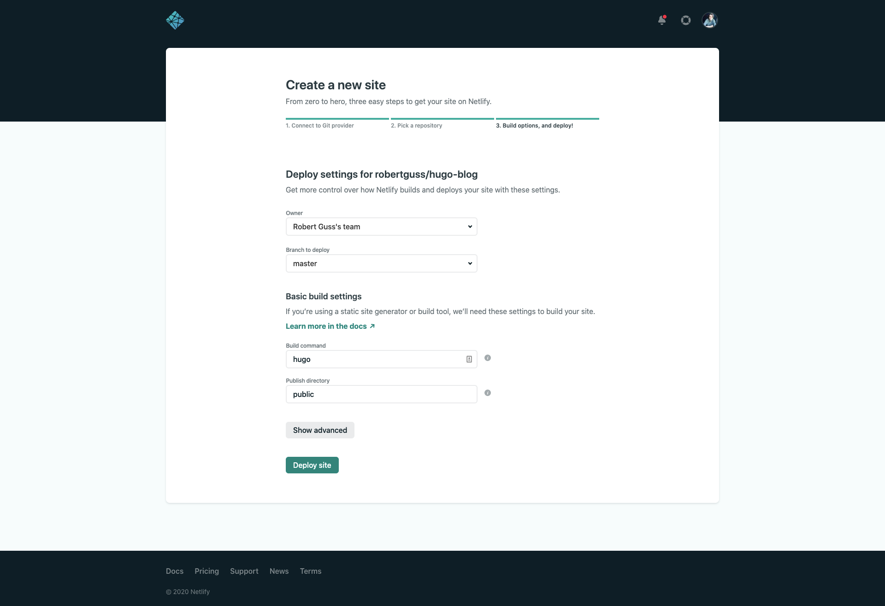

The click the green button "Deploy site"

You should then be taken back to the site dashboard where the site will begin to deploy. It shouldn't take very long
before you see a random url at the top.

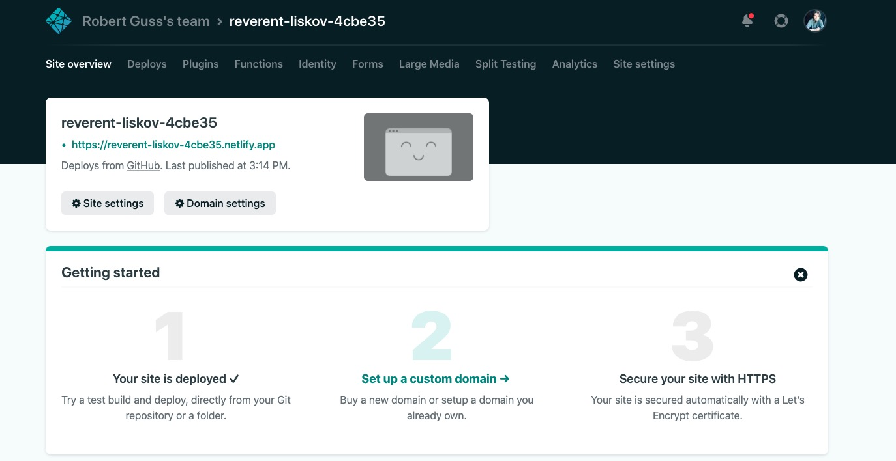

Click on the green url and it should take you to our new Hugo site!

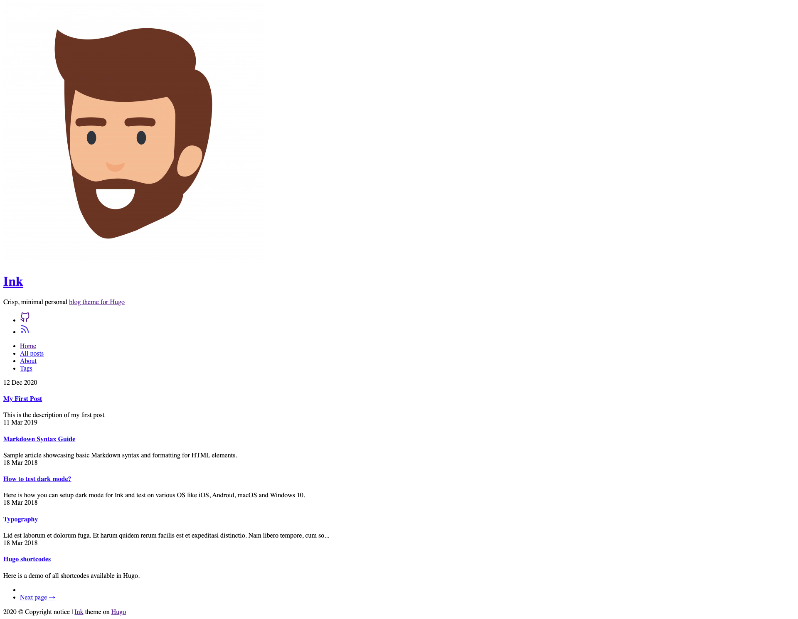

Wait!?! Why is our site broken?

If we inspect our site using Chrome dev tools and open up the console we can see we have some mixed content warnings and
a reference to `http://example.org/js/main.js`. Where is this url coming from?

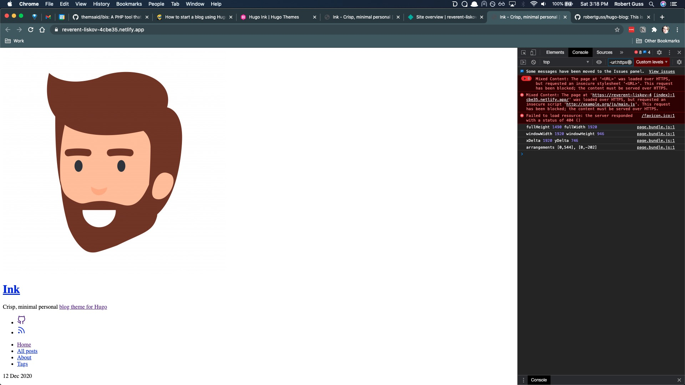

If you open up `config.toml` you will see the following on line 1:

```toml
baseURL = "http://example.org/"
```

Change it to the following:

```bash
baseURL = "/"
```

We will need to add these changes to git and push them up to GitHub.

```bash
git add .
git commit -m "fixed base url in config.toml"
git push
```

Once our change has been pushed up to GitHub, Netlify will automatically detect this change and begin to redeploy our
site. This ci/cd all comes for free from Netlify with out us having to setup and configure anything! We just push to
your master branch and Netlify takes care of the rest.

If you refresh your Netlify url, the site should be fixed.

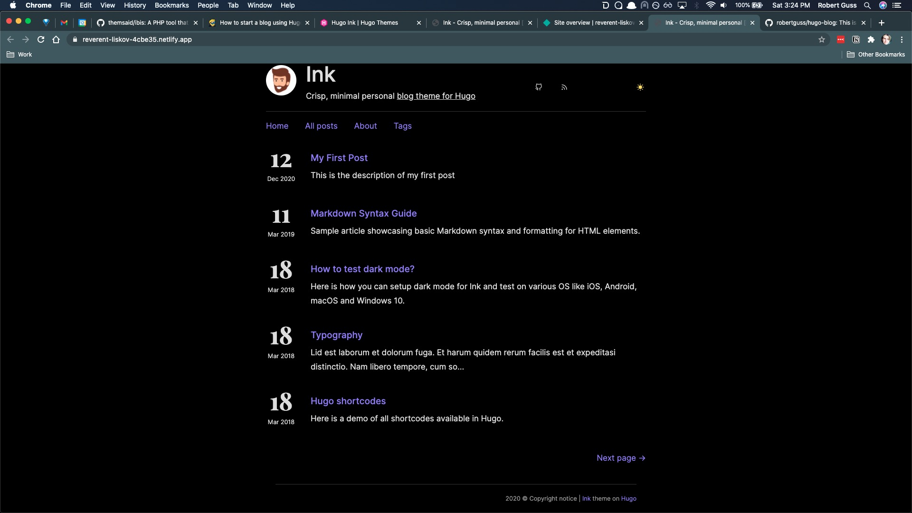
